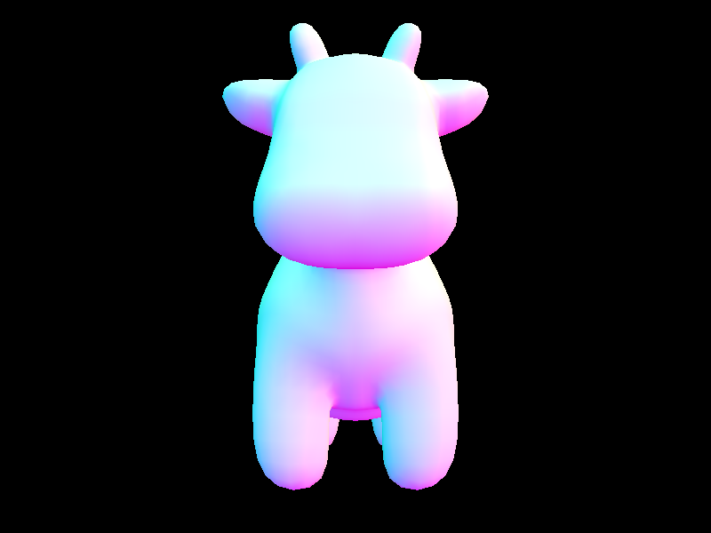
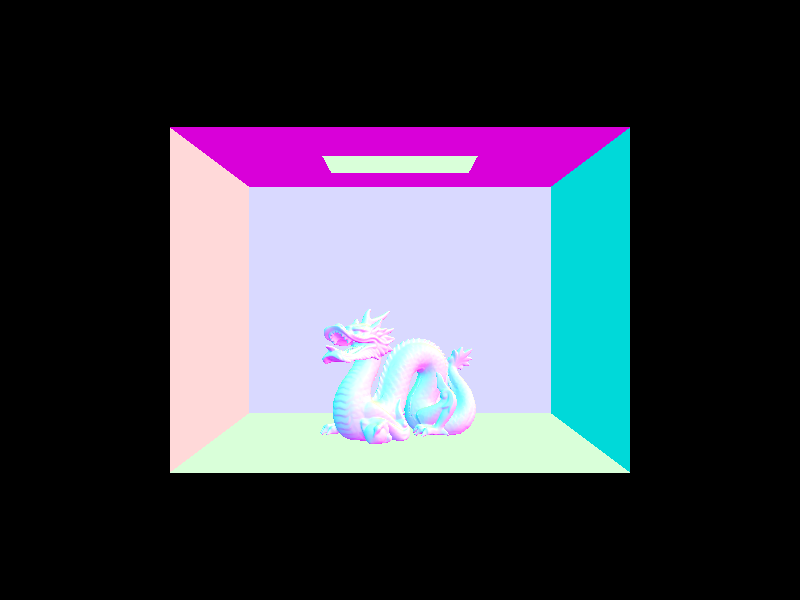
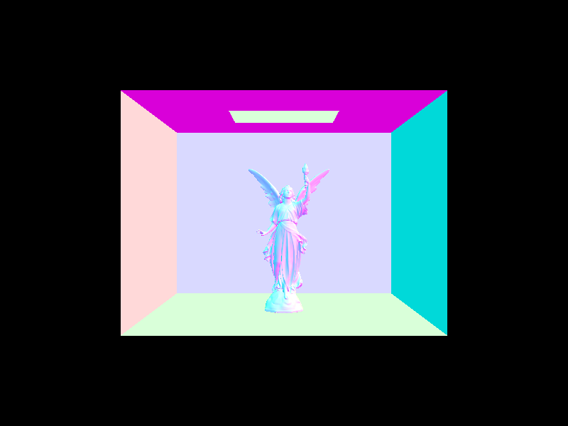
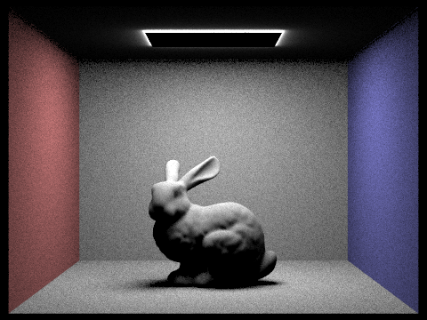
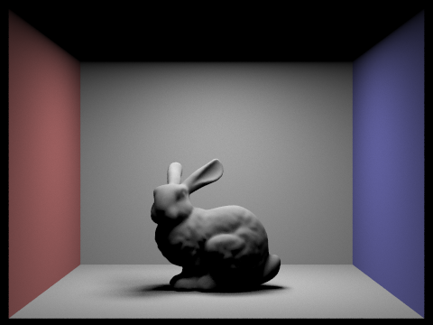
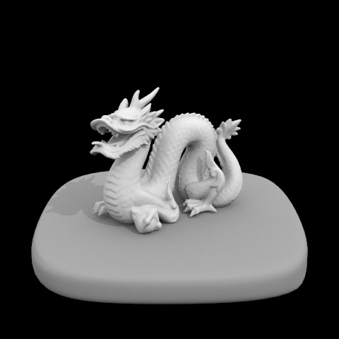
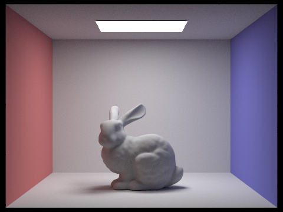

# PathTracer1
Implemented a path tracing algorithm which simulates the interaction of light rays with primitive shapes (spheres and triangles), to allow for the rendering of 3D meshes with realistic lighting.

## Part 1: Ray Generation and Intersection

Started by setting up basic ray generation and allowing for the intersection of rays with spheres and triangles, including the calculation of normals to allow for simple, fast shading.

### Simple model rendering

  

## Part 2: Bounding Volume Hierarchy

Test ray by Bounding volume hierarchy(BVH) to accelerate.

### Complex model rendering

  

## Part 3: Direct Illumination

Two direct sampling functions: uniform hemisphere sampling and lighting sampling.

### Uniform hemisphere sampling

### Light sampling

  

## Part 4: Global Illumination

Combined direct illumination with indirect illumination to get global illumination effect. Compared to direct lighting, the BSDF is sampled at the hit point and recursively trace a ray in that sample direction.

Bunny with 1024 samples per pixel.

  
